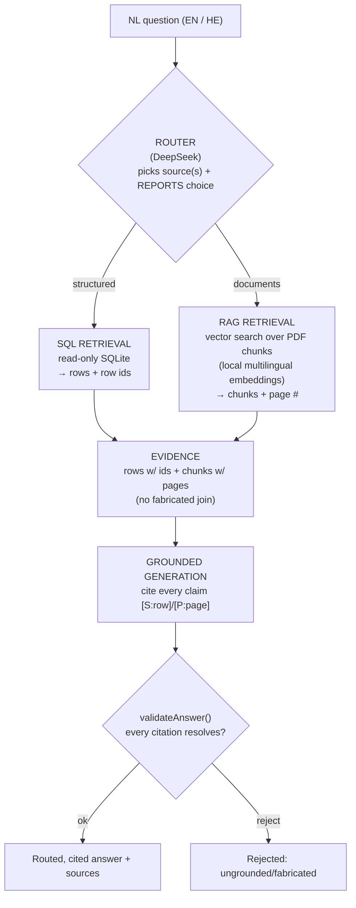
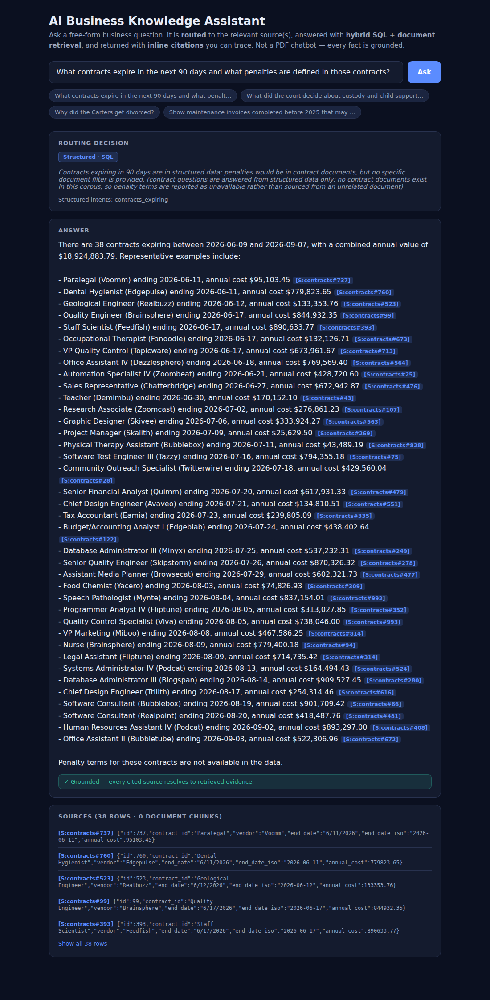
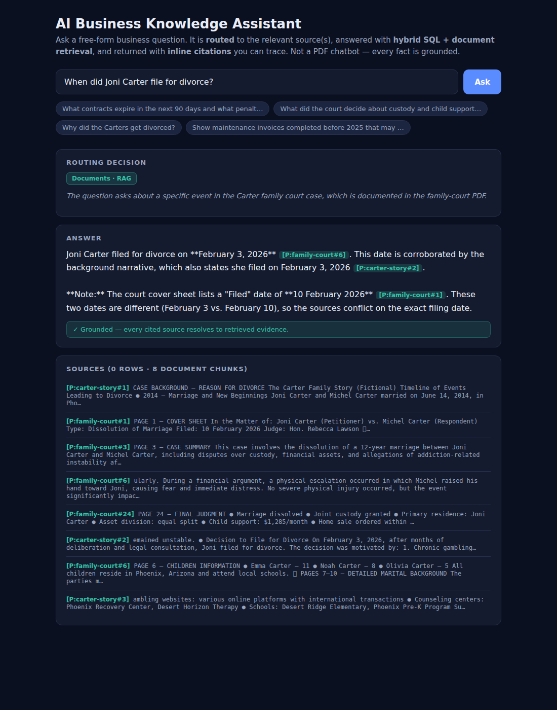
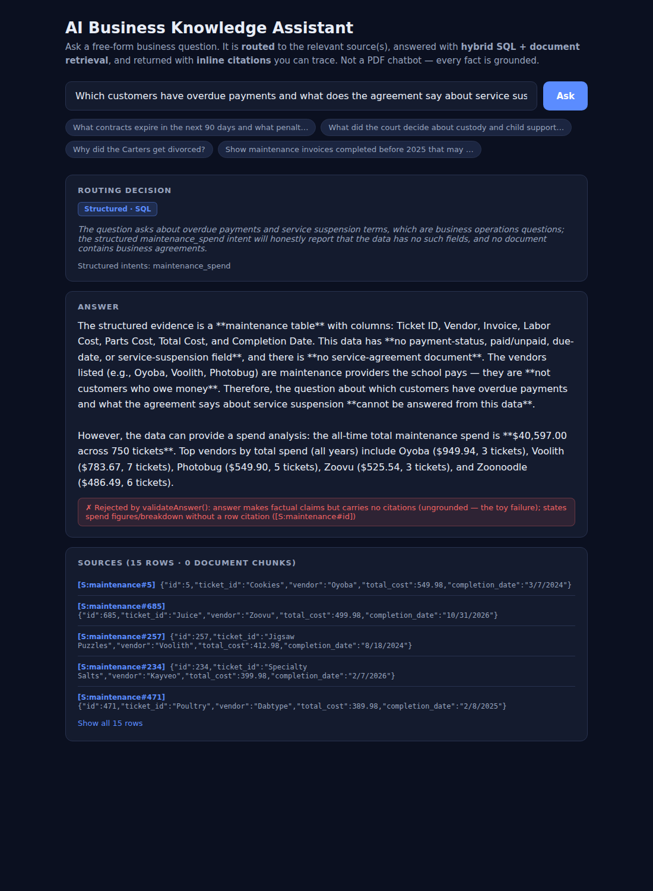

# AI Business Knowledge Assistant — Client Deliverable

**A working MVP that answers business questions by routing them to the right source(s), retrieving with a hybrid of SQL + RAG, and returning a grounded answer with inline citations you can trace.**

This is **not** a PDF chatbot and **not** "upload PDFs into a vector database and do semantic search" — the approach you explicitly ruled out. It is a real **query-routing → hybrid-retrieval → grounded-generation → source-attribution** pipeline, built to extend to your future CRM / email / cloud-storage / case-management sources.

---

## Try it now

- **Live demo:** https://contract-retriever-rag.vercel.app
- **Source code (public):** https://github.com/qufeiz/Contract-Retriever-RAG

Ask any of the example questions in the demo, or type your own. Every answer shows **which source(s) it routed to** and **a citation for every fact**.

---

## How it works

1. **Query routing** — a real LLM decision picks the relevant source(s) and **reports it** in the UI (it's not a hidden heuristic).
2. **Hybrid retrieval** — SQL over your structured data (every row carries a stable id) + RAG over your documents (every chunk carries its page).
3. **Grounded generation** — the answer is composed **only** from retrieved evidence, with an inline citation on every fact.
4. **Source attribution + a content-fidelity gate** — `validateAnswer()` rejects any answer whose citation doesn't resolve to real evidence, so "fluent but ungrounded" can't ship. The two source domains (structured vs. documents) are **never merged on an invented join**.

Full architecture + the data-flow diagram: [architecture.md](architecture.md). Engine internals: [features/shared-engine/reference.md](features/shared-engine/reference.md).

---

## What it can do (three worked capabilities)

Each capability is a real feature with its own golden examples, regression tests, and the screenshots below — all captured from the live demo.

### 1. Contract Intelligence — *expiry, value, and honest about penalties*

Ask *"What contracts expire in the next 90 days and what penalties are defined in those contracts?"* → **38 contracts** expiring, combined annual value **$18,924,883.79**, each row cited — and an **honest statement that penalty terms are not available** (your contract data has no penalty field and no contract documents). It never fabricates a penalty and never pulls from the unrelated case file.

Full guide: [contract-intelligence/user-guide.md](features/contract-intelligence/user-guide.md).

### 2. Case File Q&A — *page-cited findings, corroboration, and surfaced conflicts*

Ask *"What was the final child support amount, and who got primary residence?"* → **$1,285/month** + **primary residence to Joni Carter**, cited to **Page 24 (Final Judgment)**. Ask about the grounds → **corroborated across both documents**. Ask the filing date → it **surfaces the conflict** (the cover sheet says 10 Feb, the narratives say 3 Feb) instead of silently picking one.

Full guide: [case-file-qa/user-guide.md](features/case-file-qa/user-guide.md).

### 3. Maintenance Spend Intelligence — *cited spend, and honest refusal over fiction*

Ask *"How much did we spend on maintenance in 2026, and which vendors cost the most?"* → **$13,485.66 across 248 tickets** (2026), **$40,597.00 all-time**, top vendors cited and drillable. Ask the literal *"which customers have overdue payments and what does the agreement say about suspension?"* → it **honestly refuses**: this data has no payment-status field and no service agreement, so it explains why and **pivots to the spend analysis it can do** — rather than inventing an overdue list.

Full guide: [maintenance-spend-intelligence/user-guide.md](features/maintenance-spend-intelligence/user-guide.md).

---

## The trust property (why this isn't naive RAG)

The single thing that distinguishes a real knowledge assistant from "PDFs in a vector DB" is that it is **honest about what it doesn't know**. This MVP makes that a *tested guarantee*, not a hope:

- **Every factual claim cites a resolvable source** (a SQLite row id or a PDF page). An answer that makes an uncited claim is **rejected** by `validateAnswer()`.
- **It states absence instead of fabricating** — no penalty data → "not available"; no payment-status field → "I can't determine overdue payments, and here's why"; a source conflict → both values surfaced, not silently resolved.
- **It never invents a join** between unrelated sources (your school operations data and the Carter case file share no key — they're composed and cited separately, never merged).

These behaviors are enforced as **red automated tests** (per-feature content-fidelity gates + journey tests that run against the live deployment), not described in prose.

---

## Data Quality Assessment

A frank evaluation of all source files — usable vs. not, and the exact defect — because a client wary of naive RAG deserves to see the data handled honestly. **Malformed rows are quarantined and flagged, never dropped silently or "fixed".**

| Source file | Loaded as | Usable? | Notes / defects |
|---|---|---|---|
| `school data 1.csv` | `contracts` (1,000 rows) | ✅ Yes — powers Contract Intelligence | Clean cost/date data. **285 rows have End&lt;Start dates** (a real anomaly) — preserved, not corrected, and can be flagged. **No penalty/terms column** → penalty questions answered "not available". |
| `school data 3.csv` | `maintenance` (750 rows) | ✅ Yes — powers Maintenance Spend | Clean. **No payment-status/due-date/suspension field** → overdue/suspension questions honestly refused. Vendors are providers paid, not debtors. |
| `school data 5.csv` | `invoice_volume` (788 rows) | ⚠️ Partial | Invoice-volume-per-student aggregates; usable for volume context, not AR. |
| `school data 6.csv` | `payroll_v2` (720 rows) | ⚠️ Available | Payroll (employee, dept, salary, net pay). Loaded; not yet surfaced as its own feature. |
| `school data 4.csv` | `payroll_v1` (235 rows) | ⚠️ Available, partly defective | **235 rows have `error: undefined method …` in the pay-method/deduction columns** — those cells are quarantined; the clean columns remain usable. |
| `school data 2.csv` | `enrollment` (1,000 rows) | ⚠️ Defective | The **`term_name` column is entirely malformed** (`error: undefined method …` in all 1,000 rows) and the `status` column holds gender values — quarantined per-cell; the rest is loadable. |
| `school data .csv` | `people` (1,000 rows) | ✅ Yes | Directory (names, emails). Usable as reference data. |
| `📄 FAMILY COURT CASE FILE (MOCK) … .pdf` | `family-court` (RAG) | ✅ Yes — powers Case File Q&A | 15 printed sections incl. the Page-24 Final Judgment. |
| `story if the Carters .pdf` | `carter-story` (RAG) | ✅ Yes — corroborating narrative | Background story; used to corroborate the court file. |

**Takeaway:** the data is realistically messy. The system **mines the usable signal, flags the defects, and refuses to fabricate** over the gaps — which is exactly the behavior that makes it trustworthy on your real, imperfect data.

---

## Extensible by design

The router + retrieval layer is **source-pluggable**. Your future integrations — CRM, email, cloud storage, case management — each register as a new retrieval source behind the same router contract, **without changing** the grounding/citation/validation layer. The per-fact citation model is what makes per-source access control addable later.

## English + Hebrew

The demo answers in **both English and Hebrew today** (the embedding model is multilingual; citations are preserved across languages). Each feature's guide includes a Hebrew golden example. RTL UI polish and Hebrew-tuned prompts are the natural next step — the architecture is already ready for them.

---

## Stack

Next.js · DeepSeek (`deepseek-chat`) for routing + generation · local `Xenova/multilingual-e5-small` embeddings (no embeddings key; the Hebrew seam) · bundled read-only SQLite + an in-app vector index · deployed on Vercel. Self-contained and reproducible (`npm run build:index` rebuilds the index deterministically from the source data).

**Quality floor:** every push runs CI — doc-lint + doc-structure-lint + typecheck + 40 unit tests; 13 journey tests run against the live deployment. The content-fidelity gates above are part of that floor.
